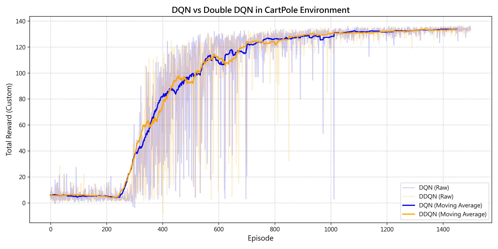

# Deep Q-Network & Double DQN for CartPole Control

這是一個專為探討強化學習演算法穩定性所建構的專案，本專案使用 PyTorch 從零實作 (Build from scratch) Deep Q-Network (DQN) 與 Double DQN (DDQN) 演算法，以解決 OpenAI Gym `CartPole-v0` 環境中的非線性控制問題。

##  專案技術亮點

1. **底層架構全實作**：
   不依賴高階 RL 套件，親自建構神經網路 (Q-Network)、經驗回放池 (Experience Replay) 與 目標網路 (Target Network) 等 DQN 核心機制，展現對演算法底層邏輯的掌握。
2. **自訂獎勵機制 (Reward Shaping)**：
   解決原始環境「稀疏獎勵」的痛點。引入基於「車體位置誤差」與「柱子傾斜角度」的連續性懲罰函數，強制模型學習全局最優解，大幅提升收斂效率。
3. **Double DQN 對照實驗 (A/B Testing)**：
   為了解決傳統 DQN 常見的「Q 值過度高估 (Overestimation)」現象，本專案額外實作了 DDQN，將動作選擇 (Action Selection) 與價值評估 (Value Evaluation) 解耦，並進行了嚴謹的對照實驗。

##  實驗結果與收斂分析


在 1500 回合的對照實驗中可以觀察到：
* **DQN (藍線)**：在訓練中期容易因為貪婪策略與 Q 值高估，導致學習曲線出現劇烈震盪。
* **Double DQN (橘線)**：成功抑制了高估現象，不僅收斂速度更快，達到最高分後的穩定度也顯著優於傳統 DQN。



##  專案結構
* `main.py`: 標準 DQN 演算法主程式。
* `compare_ddqn.py`: DQN 與 DDQN 對照實驗腳本，包含移動平均 (Moving Average) 的視覺化圖表生成。


##  如何執行
```bash
# 1. 安裝所需套件
pip install -r requirements.txt

# 2. 執行 DQN vs DDQN 對照實驗
python compare_ddqn.py

---
